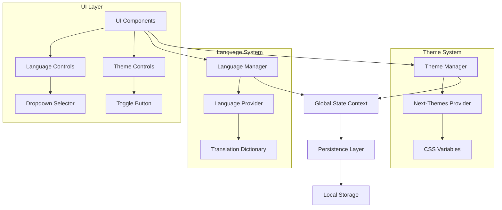
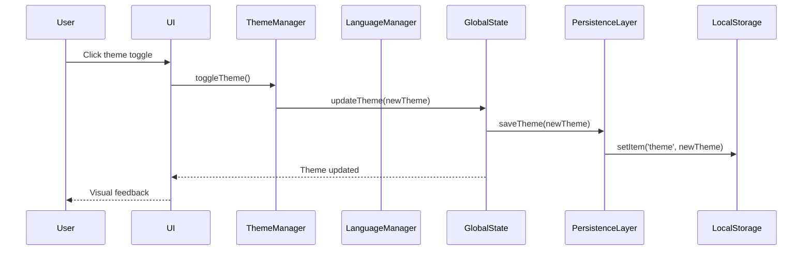

# Design Document: Theme and Language Switcher

## Overview

This design enhances the existing Next.js application with comprehensive theme (dark/light mode) and language switching capabilities. The solution builds upon the current `next-themes` and custom `LanguageProvider` infrastructure, adding persistent storage, global state management, and responsive UI controls.

The system provides seamless theme and language switching across all pages with sub-100ms response times, persistent user preferences, and accessibility-compliant controls.

## Architecture

### High-Level Architecture



### Component Interaction Flow



## Components and Interfaces

### 1. Enhanced Theme Manager

**Purpose**: Extends the existing `next-themes` integration with persistence and global state management.

**Key Interfaces**:
```typescript
interface ThemeManager {
  currentTheme: 'light' | 'dark' | 'system';
  toggleTheme(): void;
  setTheme(theme: 'light' | 'dark' | 'system'): void;
  isLoading: boolean;
}

interface ThemeContextType {
  theme: string;
  setTheme: (theme: string) => void;
  resolvedTheme: string;
  systemTheme: string;
}
```

**Implementation Strategy**:
- Leverage existing `next-themes` provider
- Add custom hooks for theme management
- Integrate with persistence layer
- Provide loading states during hydration

### 2. Enhanced Language Manager

**Purpose**: Extends the existing `LanguageProvider` with persistence and improved translation management.

**Key Interfaces**:
```typescript
interface LanguageManager {
  currentLanguage: 'th' | 'en';
  setLanguage(language: 'th' | 'en'): void;
  t(key: string, params?: Record<string, string>): string;
  isLoading: boolean;
}

interface TranslationDictionary {
  [language: string]: {
    [key: string]: string;
  };
}
```

**Implementation Strategy**:
- Enhance existing `LanguageProvider`
- Add persistence integration
- Expand translation dictionary
- Support parameterized translations

### 3. Global State Context

**Purpose**: Manages application-wide theme and language state with persistence.

**Key Interfaces**:
```typescript
interface GlobalStateContextType {
  theme: ThemeState;
  language: LanguageState;
  updateTheme(theme: string): Promise<void>;
  updateLanguage(language: string): Promise<void>;
  isInitialized: boolean;
}

interface ThemeState {
  current: string;
  resolved: string;
  isLoading: boolean;
}

interface LanguageState {
  current: string;
  isLoading: boolean;
}
```

### 4. Persistence Layer

**Purpose**: Handles saving and loading user preferences with error handling.

**Key Interfaces**:
```typescript
interface PersistenceLayer {
  saveTheme(theme: string): Promise<void>;
  loadTheme(): Promise<string | null>;
  saveLanguage(language: string): Promise<void>;
  loadLanguage(): Promise<string | null>;
  isAvailable(): boolean;
}

interface StorageAdapter {
  setItem(key: string, value: string): void;
  getItem(key: string): string | null;
  removeItem(key: string): void;
}
```

### 5. UI Control Components

**Theme Toggle Component**:
```typescript
interface ThemeToggleProps {
  size?: 'sm' | 'md' | 'lg';
  variant?: 'icon' | 'button' | 'switch';
  showLabel?: boolean;
}
```

**Language Selector Component**:
```typescript
interface LanguageSelectorProps {
  variant?: 'dropdown' | 'toggle' | 'menu';
  showFlag?: boolean;
  showLabel?: boolean;
}
```

## Data Models

### Theme Configuration
```typescript
type ThemeMode = 'light' | 'dark' | 'system';

interface ThemeConfig {
  mode: ThemeMode;
  timestamp: number;
  version: string;
}
```

### Language Configuration
```typescript
type SupportedLanguage = 'th' | 'en';

interface LanguageConfig {
  language: SupportedLanguage;
  timestamp: number;
  version: string;
}
```

### Persistence Schema
```typescript
interface UserPreferences {
  theme: ThemeConfig;
  language: LanguageConfig;
  metadata: {
    lastUpdated: number;
    version: string;
  };
}
```

## Correctness Properties

*A property is a characteristic or behavior that should hold true across all valid executions of a system-essentially, a formal statement about what the system should do. Properties serve as the bridge between human-readable specifications and machine-verifiable correctness guarantees.*

### Property Reflection

After analyzing the acceptance criteria, several properties can be consolidated:
- Properties 1.3, 2.3 can be combined into a general persistence property
- Properties 1.4, 2.4, 3.4, 6.1, 6.2 can be combined into a restoration property
- Properties 1.2, 2.2 can be combined into an immediate propagation property
- Properties 5.1, 5.2, 5.3 can be combined into a performance property

### Core Properties

**Property 1: Theme Toggle Consistency**
*For any* application state, when the theme toggle is activated, the theme should switch to the opposite mode (light ↔ dark) and all UI components should reflect the new theme immediately.
**Validates: Requirements 1.1, 1.2**

**Property 2: Language Switch Consistency**
*For any* application state, when a language is selected, all UI components should display text in the selected language immediately.
**Validates: Requirements 2.1, 2.2**

**Property 3: Preference Persistence**
*For any* valid theme or language selection, the preference should be stored in localStorage and retrievable after application restart.
**Validates: Requirements 1.3, 2.3, 6.1, 6.2**

**Property 4: State Restoration**
*For any* stored preferences, when the application loads, it should restore the exact theme and language settings that were previously saved.
**Validates: Requirements 1.4, 2.4, 3.4**

**Property 5: Navigation Consistency**
*For any* page navigation within the application, the current theme and language settings should remain unchanged across all routes.
**Validates: Requirements 3.1, 3.3**

**Property 6: Performance Requirements**
*For any* theme or language change operation, the change should be applied and visible within 100ms without blocking user interactions.
**Validates: Requirements 5.1, 5.2, 5.3**

**Property 7: Default Fallback Behavior**
*For any* scenario where no preferences are stored or preferences are corrupted, the system should fall back to light theme and Thai language defaults.
**Validates: Requirements 1.5, 2.5, 6.4**

**Property 8: UI Control Visibility**
*For any* page in the application, theme toggle and language selector controls should be present and accessible to users.
**Validates: Requirements 4.1, 4.2**

**Property 9: Visual State Feedback**
*For any* theme or language control activation, the UI should provide clear visual feedback indicating the current selection state.
**Validates: Requirements 4.3, 4.4**

## Error Handling

### Theme System Error Handling

1. **CSS Variable Loading Failures**
   - Fallback to browser default styles
   - Log error for debugging
   - Retry mechanism for transient failures

2. **Next-Themes Hydration Issues**
   - Prevent flash of incorrect theme
   - Use loading states during hydration
   - Graceful degradation to system theme

3. **Invalid Theme Values**
   - Validate theme values before application
   - Sanitize user input
   - Reset to default on invalid values

### Language System Error Handling

1. **Missing Translation Keys**
   - Return the key itself as fallback
   - Log missing translations for development
   - Graceful degradation to English

2. **Dictionary Loading Failures**
   - Fallback to embedded translations
   - Retry mechanism for network failures
   - Cache successful loads

3. **Invalid Language Codes**
   - Validate language codes
   - Fallback to default language
   - User notification for unsupported languages

### Persistence Layer Error Handling

1. **LocalStorage Unavailable**
   - Detect storage availability
   - Fallback to in-memory storage
   - Graceful degradation without persistence

2. **Storage Quota Exceeded**
   - Clean up old preferences
   - Compress preference data
   - User notification if critical

3. **Corrupted Preference Data**
   - Validate data structure on load
   - Reset to defaults on corruption
   - Backup and restore mechanisms

## Testing Strategy

### Dual Testing Approach

The testing strategy employs both unit tests and property-based tests to ensure comprehensive coverage:

**Unit Tests**: Focus on specific examples, edge cases, and integration points
- Component rendering with different themes/languages
- Error handling scenarios
- Storage adapter functionality
- UI control interactions

**Property-Based Tests**: Verify universal properties across all inputs using fast-check library
- Theme switching behavior across random states
- Language switching with random text content
- Persistence operations with random preference data
- Performance requirements with random interaction patterns

### Property-Based Testing Configuration

- **Library**: fast-check for TypeScript/JavaScript
- **Iterations**: Minimum 100 iterations per property test
- **Test Tags**: Each property test references its design document property
- **Tag Format**: `Feature: theme-language-switcher, Property {number}: {property_text}`

### Test Categories

1. **Theme Management Tests**
   - Theme toggle functionality
   - CSS variable application
   - Persistence and restoration
   - Performance benchmarks

2. **Language Management Tests**
   - Language switching behavior
   - Translation key resolution
   - Dictionary loading and caching
   - Fallback mechanisms

3. **Integration Tests**
   - Cross-component theme propagation
   - Navigation state persistence
   - Error recovery scenarios
   - Accessibility compliance

4. **Performance Tests**
   - Theme switch timing
   - Language change responsiveness
   - Storage operation efficiency
   - Memory usage optimization

### Testing Tools and Frameworks

- **Unit Testing**: Jest + React Testing Library
- **Property Testing**: fast-check
- **Integration Testing**: Playwright for cross-page scenarios
- **Performance Testing**: Web Vitals + custom timing measurements
- **Accessibility Testing**: axe-core integration